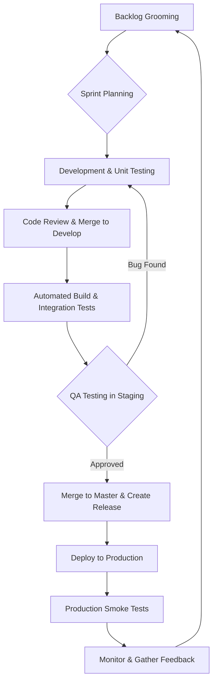
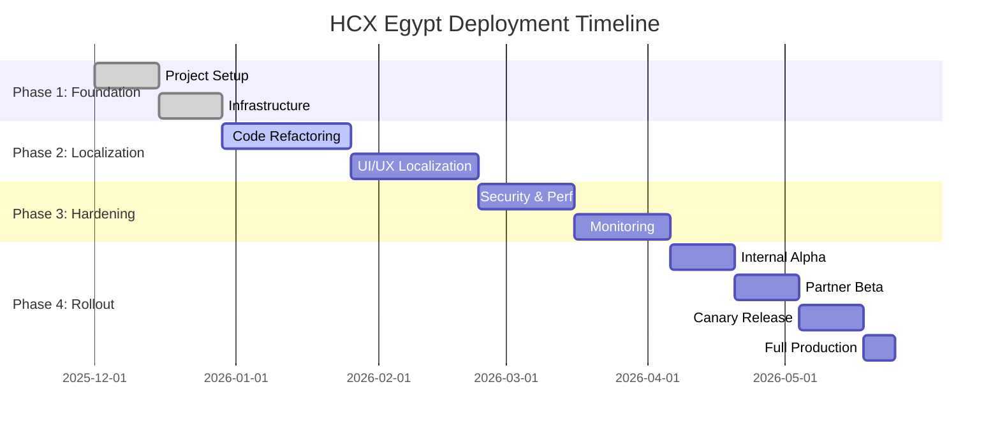

# Agile Deployment Plan - HCX Egypt Platform

## 1. Introduction

This document outlines a comprehensive agile deployment plan for contextualizing, localizing, and deploying the HCX platform for the Egyptian market. The plan is designed to ensure a **zero-disruption** transition, with a focus on iterative development, continuous integration, and phased rollout.

## 2. Guiding Principles

- **Agile & Iterative**: Deliver value in small, incremental steps.
- **Zero-Disruption**: No impact on existing users or services.
- **Quality First**: Comprehensive testing at every stage.
- **Automate Everything**: CI/CD, testing, and infrastructure.
- **Data-Driven Decisions**: Use metrics to guide the process.
- **Security by Design**: Integrate security into every phase.

## 3. Team Structure & Roles

| Role | Responsibilities | Headcount |
|---|---|---|
| **Product Owner** | Defines vision, manages backlog, prioritizes features | 1 |
| **Scrum Master** | Facilitates agile process, removes impediments | 1 |
| **Tech Lead / Architect** | Technical guidance, design decisions, code quality | 1 |
| **Backend Engineers** | Core service development, API implementation | 4-5 |
| **Frontend Engineers** | UI/UX development, localization | 2-3 |
| **DevOps Engineers** | CI/CD, infrastructure, monitoring, security | 2-3 |
| **QA Engineers** | Test planning, automated testing, quality assurance | 2 |
| **Security Engineer** | Security audits, penetration testing, compliance | 1 |
| **Total** | | **14-17** |

## 4. Development Workflow



## 5. Sprint Structure

- **Sprint Length**: 2 weeks
- **Sprint Ceremonies**:
  - **Sprint Planning**: 4 hours (start of sprint)
  - **Daily Standup**: 15 minutes (daily)
  - **Sprint Review**: 2 hours (end of sprint)
  - **Sprint Retrospective**: 1.5 hours (end of sprint)
  - **Backlog Grooming**: 2 hours (mid-sprint)

## 6. Deployment Strategy: Zero-Disruption

### 6.1 Phased Rollout Approach

1.  **Internal Alpha**: Deploy to a production-like environment for internal testing by the project team.
2.  **Partner Beta**: Release to a limited set of trusted partners (hospitals, insurance companies) for real-world feedback.
3.  **Canary Release**: Gradually roll out to a small percentage of public users (e.g., 1%, 5%, 20%).
4.  **Full Production**: Release to all users after successful canary phase.

### 6.2 Blue-Green Deployment

This strategy ensures zero downtime during releases by maintaining two identical production environments: `blue` (live) and `green` (idle).

```mermaid
graph TD
    subgraph Before Deployment
        LB1(Load Balancer) --> Blue(Blue Environment - v1.0);
        Green(Green Environment - v1.0) -- Idle --> LB1;
    end

    subgraph Deployment
        Deploy(Deploy v1.1) --> Green;
        Test(Run Tests on Green) --> Deploy;
    end

    subgraph After Deployment
        LB2(Load Balancer) --> Green2(Green Environment - v1.1);
        Blue2(Blue Environment - v1.0) -- Idle --> LB2;
    end

    Before Deployment --> Deployment --> After Deployment;
```

### 6.3 Database Migration Strategy

- **Expand-Contract Pattern**: Ensure backward and forward compatibility.
  1.  **Expand**: Add new columns/tables without removing old ones.
  2.  **Migrate**: Application writes to both old and new schemas.
  3.  **Verify**: Data is consistent between schemas.
  4.  **Contract**: Remove old columns/tables after all services are updated.

## 7. Release Plan & Timeline

### Phase 1: Foundation & Setup (Weeks 1-4)

- **Sprint 1-2**: Project setup, infrastructure provisioning, CI/CD pipeline, and initial code analysis.
- **Deliverables**: 
  - Production-ready infrastructure on AWS/Azure.
  - Fully automated CI/CD pipeline.
  - Detailed code refactoring plan.

### Phase 2: Contextualization & Localization (Weeks 5-12)

- **Sprint 3-6**: Remove India-specific code, implement Egyptian localization (phone, ID, address), and update UI/UX.
- **Deliverables**:
  - Fully localized platform with Egyptian data formats.
  - All Swasth/India branding removed.
  - Arabic language support (RTL).

### Phase 3: Production Hardening (Weeks 13-18)

- **Sprint 7-9**: Implement security recommendations, performance optimizations, and monitoring/alerting.
- **Deliverables**:
  - Secure, scalable, and observable platform.
  - Production readiness checklist completed.
  - Disaster recovery plan tested.

### Phase 4: Phased Rollout (Weeks 19-24)

- **Sprint 10-12**: Internal alpha, partner beta, and canary release.
- **Deliverables**:
  - Successful deployment to production.
  - Positive feedback from early adopters.
  - Stable system with low error rates.

### Gantt Chart



## 8. Budget Estimate

| Category | Estimated Cost (USD) | Notes |
|---|---|---|
| **Personnel** | $350,000 - $450,000 | 15 engineers for 6 months |
| **Infrastructure** | $100,000 - $150,000 | AWS/Azure hosting costs |
| **Software & Tools** | $30,000 - $50,000 | Licenses, monitoring tools |
| **Contingency** | $50,000 - $75,000 | 15% for unforeseen issues |
| **Total** | **$530,000 - $725,000** | |

## 9. Risks & Mitigation

| Risk | Probability | Impact | Mitigation Strategy |
|---|---|---|---|
| **Technical Debt** | High | High | Allocate 20% of each sprint to refactoring. | 
| **Scope Creep** | Medium | High | Strict backlog grooming and change control. |
| **Regulatory Hurdles** | Medium | Critical | Engage with legal/compliance teams early. |
| **Partner Integration** | High | Medium | Provide clear API documentation and support. |
| **Security Vulnerabilities** | Medium | Critical | Continuous security testing and audits. |
| **Team Attrition** | Low | Medium | Foster a positive work environment, offer competitive compensation. |

## 10. Communication Plan

- **Stakeholder Updates**: Bi-weekly email summary and monthly review meeting.
- **Team Communication**: Daily standups, Slack/Teams for real-time chat, and Confluence for documentation.
- **Partner Communication**: Regular check-ins, dedicated support channel, and joint planning sessions.

## 11. Success Metrics

- **Adoption Rate**: >80% of target partners onboarded within 6 months.
- **User Satisfaction**: >4.5/5 rating from user feedback.
- **System Uptime**: >99.95% availability.
- **Performance**: <500ms average API response time.
- **Security**: Zero critical vulnerabilities in production.
- **Cost**: Stay within 10% of the approved budget.
