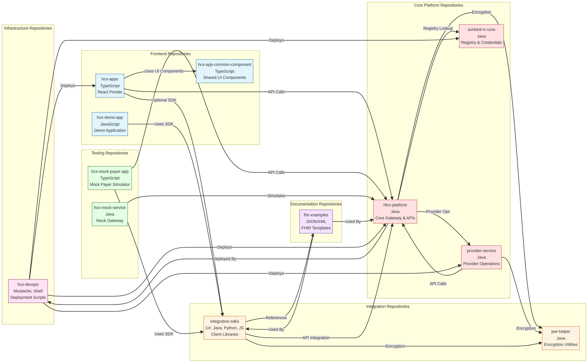
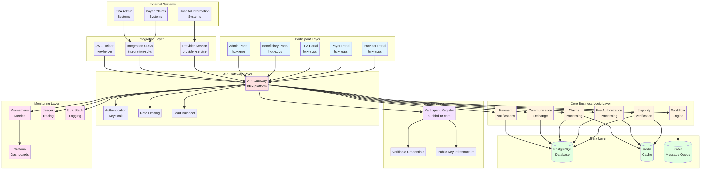
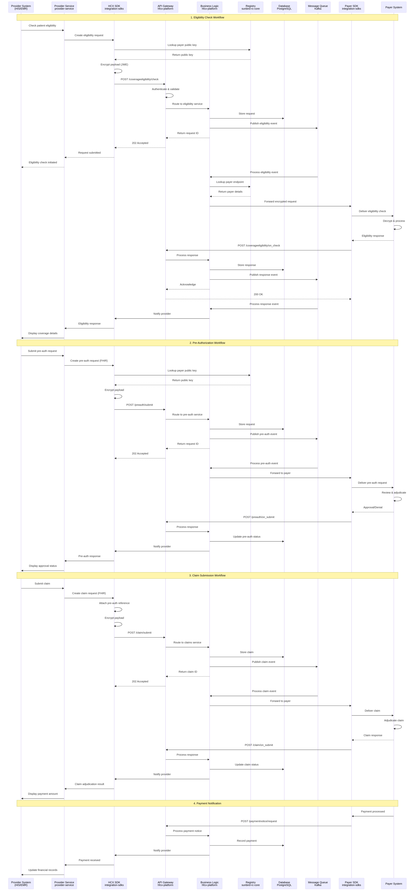
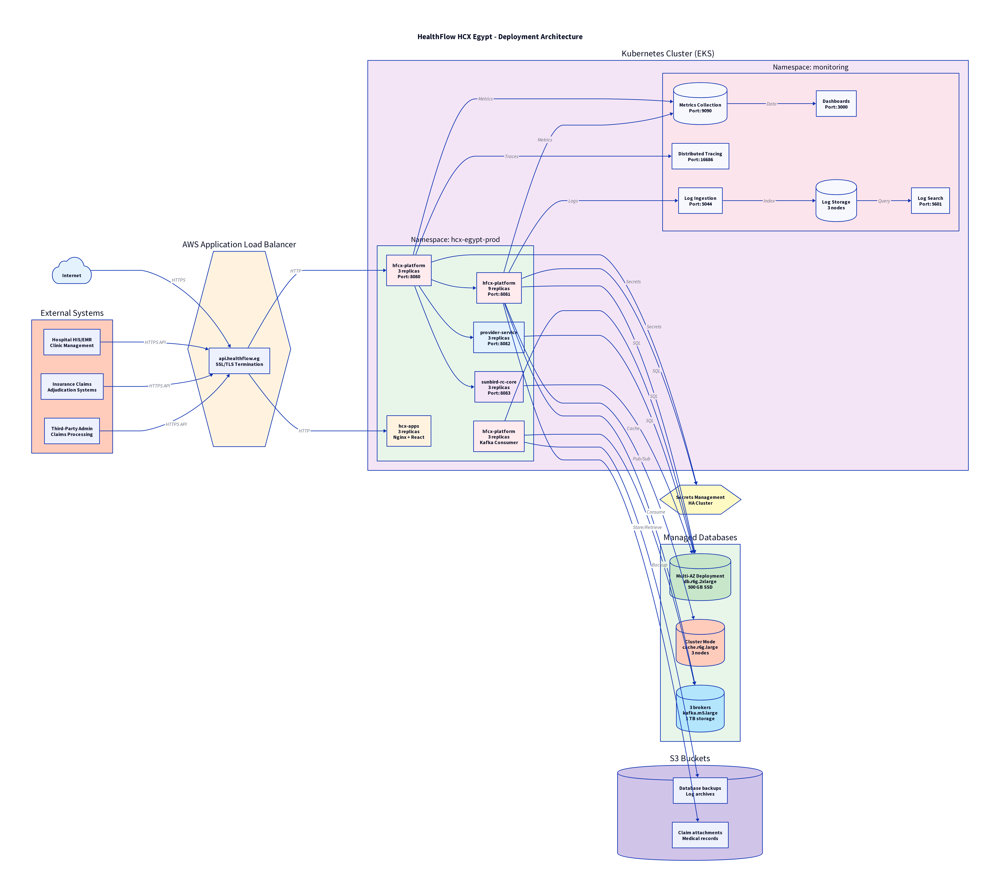

# HealthFlow HCX Egypt - Technical Architecture

**Document Version**: 1.0  
**Date**: December 1, 2025  
**Organization**: HealthFlow-Medical-HCX

---

## 1. Introduction

This document provides a comprehensive overview of the technical architecture for the HealthFlow HCX Egypt platform. It details the system components, their interactions, data flows, deployment strategies, and security mechanisms. The architecture is designed to be scalable, secure, and compliant with Egyptian healthcare regulations.

## 2. Repository Mapping

The HealthFlow HCX Egypt platform is composed of 12 repositories, each with a specific role. The following table summarizes the repository inventory:

| Repository | Language | Role Category |
|---|---|---|
| hfcx-platform | Java | Core Platform |
| hcx-apps | TypeScript | Management Applications |
| hcx-mock-payer-app | TypeScript | Testing & Simulation |
| provider-service | Java | Provider Integration |
| hcx-devops | Mustache | Infrastructure & Deployment |
| sunbird-rc-core | Java | Registry & Credentials |
| integration-sdks | C#, Java, Python, JS | Integration Tools |
| hcx-app-common-component | TypeScript | Shared UI Components |
| hcx-mock-service | Java | Testing & Simulation |
| fhir-examples | - | Documentation & Examples |
| jwe-helper | Java | Security Utilities |
| hcx-demo-app | JavaScript | Demo & Reference |

### Repository Dependencies

The following diagram illustrates the dependencies between the repositories:

## 3. System Architecture

The HealthFlow HCX platform is built on a microservices architecture, with each service responsible for a specific business capability. The following diagram provides a high-level overview of the system architecture:

### Key Architectural Layers

- **Participant Layer**: Contains the user-facing portals for providers, payers, TPAs, beneficiaries, and system administrators.
- **API Gateway Layer**: Serves as the single entry point for all API requests, handling authentication, rate limiting, and routing.
- **Core Business Logic Layer**: Implements the core HCX workflows, including eligibility checks, pre-authorizations, and claims processing.
- **Integration Layer**: Provides tools and services for integrating with external systems, including SDKs and a dedicated provider service.
- **Registry Layer**: Manages participant identities, credentials, and public keys.
- **Data Layer**: Consists of the PostgreSQL database, Redis cache, and Kafka message queue.
- **Monitoring Layer**: Provides observability into the platform's health and performance.

## 4. Data Flow Architecture

The following sequence diagram illustrates the data flow for the key HCX workflows:

### Key Workflows

1. **Eligibility Check**: A provider checks a patient's insurance coverage before rendering services.
2. **Pre-Authorization**: A provider requests approval from a payer for a specific treatment or procedure.
3. **Claim Submission**: A provider submits a claim to a payer for reimbursement.
4. **Payment Notification**: A payer notifies a provider of a payment.

All data exchanged between participants is encrypted end-to-end using JWE, ensuring that only the intended recipient can decrypt and view the data.

## 5. Deployment Architecture

The HealthFlow HCX platform is designed for deployment on a Kubernetes cluster, providing scalability, reliability, and portability. The following diagram illustrates the production deployment architecture:

### Key Deployment Components

- **Kubernetes Cluster (EKS)**: The platform is deployed on Amazon EKS, a managed Kubernetes service.
- **Managed Databases**: The platform uses Amazon RDS for PostgreSQL, ElastiCache for Redis, and MSK for Kafka.
- **Load Balancer (ALB)**: An AWS Application Load Balancer distributes traffic across the API gateway and frontend applications.
- **Secrets Management**: HashiCorp Vault is used for securely storing and managing secrets.
- **Storage (S3)**: Amazon S3 is used for storing database backups and claim attachments.

## 6. Security Architecture

Security is a core component of the HealthFlow HCX platform. The following security measures are implemented:

- **End-to-End Encryption**: All data is encrypted using JWE, ensuring that only the sender and receiver can view the data.
- **Authentication**: All API requests are authenticated using JWTs, and participants are authenticated using API keys and secrets.
- **Authorization**: Role-based access control (RBAC) is used to restrict access to resources based on user roles.
- **Secrets Management**: All secrets are stored in HashiCorp Vault.
- **Secure Coding Practices**: The platform is developed using secure coding practices to prevent common vulnerabilities.

## 7. Conclusion

The HealthFlow HCX Egypt platform is a robust, scalable, and secure platform for health claims exchange. Its modular architecture, based on microservices and open standards, allows for flexibility and interoperability. The platform is designed to meet the specific needs of the Egyptian healthcare market, with support for local regulations and standards.
